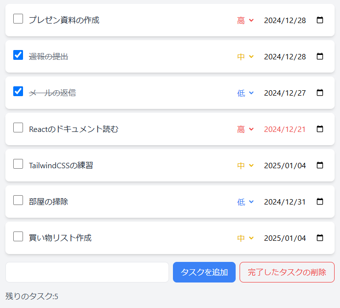

# Enhanced Todo App with Priority Management

タスクの優先度と期限を管理できる、モダンなTodoアプリケーションです。
TailwindCSSを使用した美しいUIと、直感的な操作性を実現しました。

## アプリケーションのスクリーンショット

撮影日時は2024/12/27

上記画像には主な特徴が表示されています：
- 優先度による色分け表示（高：赤、中：黄、低：青）
- 日付による期限管理
- タスクの完了・未完了の切り替え
- 残りのタスク数の表示

## 主な機能

### 基本的なタスク管理
- タスクの追加・削除
- タスクの完了・未完了の切り替え
- 完了済みタスクの一括削除
- 残りのタスク数の表示

### 拡張機能
- 優先度管理システム
  - 3段階の優先度設定（高・中・低）
  - 優先度に応じた色分け表示（高:赤、中:黄、低:青）
  - 新規タスクの優先度デフォルト値設定

- 期限管理機能
  - タスクごとの期限日設定
  - 期限切れタスクの視覚的警告
  - 日付選択の直感的なUI

### UI/UX の特徴
- モダンでクリーンなデザイン
- レスポンシブ対応のレイアウト
- タスクのカード形式表示
- 視認性を重視した色使い
- 直感的な操作性

## 使用技術

- **フレームワーク/ライブラリ**
  - React.js
  - TailwindCSS
  - UUID

## セットアップ手順

1. パッケージのインストール
npm install

2. アプリケーションの起動
npm start
ブラウザで自動的に http://localhost:3000 が開き、アプリケーションが表示されます。

## 開発での工夫点

### コンポーネント設計
- 責任の分離を意識したコンポーネント分割
- Props を活用した効率的なデータフロー
- 再利用可能なコンポーネント設計

### 状態管理
- React Hooks（useState, useRef）の効率的な活用
- 効率的なstate更新処理
- コンポーネント間のデータ共有の最適化

### UIデザイン
- TailwindCSSによる一貫したデザイン
- 視覚的フィードバックの実装
  - 優先度による色分け表示
  - 期限切れタスクの警告表示
  - 完了タスクの視覚的表現
- レスポンシブ対応のレイアウト

### 機能の改善
- 空白文字のトリミング処理
- 優先度のデフォルト値設定
- 期限管理システムの実装
